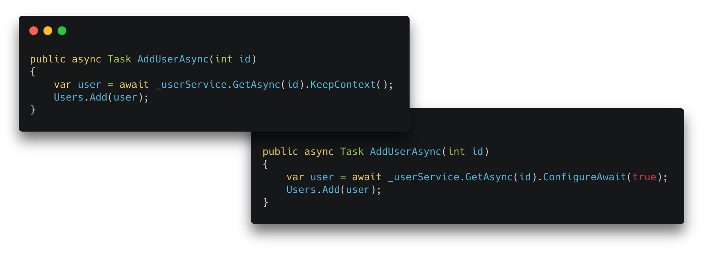

If you ever had the joy of async programming in .NET, you might have seen this guy:

    await anyTask.ConfigureAwait(false);

`ConfigureAwait()` tells the .NET runtime how you want your code to continue after it waited for the completion of an instruction. 

This sounds easy so you might be surprised how many blog posts you'll find about this topic on the internet.

The most important one you should know is this one from [Stephen Toub](https://devblogs.microsoft.com/dotnet/author/toub/):
- [ConfigureAwait FAQ (Dec 2019)](https://devblogs.microsoft.com/dotnet/configureawait-faq)

If you don't want to fight through this massive blog post, I highly recommend watching the following video. It's not mine but I wish every .NET developer would get a chance to watch it:
- [Understanding ConfigureAwait](https://www.youtube.com/watch?v=avhLfcgIwbg)

## So why should I care?

If you are using async and await in your code without looking after `ConfigureAwait()`, you are very likely to either run into cross-thread exceptions and deadlocks or miss an opportunity to speed up async code. 

To clarify, let's take two passages from Stephen's blog post:

> ### Why would I want to use `ConfigureAwait(false)`?
> `ConfigureAwait(continueOnCapturedContext: false)` is used to **avoid forcing the callback to be invoked on the original context** or scheduler. This has a few benefits: *[...]* Improving performance & Avoiding deadlocks.

> ### Why would I want to use `ConfigureAwait(true)`?
> You wouldn’t, **unless you were using it purely as an indication that you were purposefully not using `ConfigureAwait(false)`**. *[...]* The `ConfigureAwait()` method accepts a Boolean because there are **some niche situations** in which you want to pass in a variable to control the configuration. But the **99% use case is with a hardcoded false argument** value, `ConfigureAwait(false)`.

### The takeaway

- Use `ConfigureAwait(false)` to tell the runtime that you **don't need to run on the same context** as you were called from.
- If you don't use `ConfigureAwait(false)` you basically say the opposite `ConfigureAwait(true)` which tells the runtime that you **want to proceed on the same context** as you were called from. This makes it the default behavior.

## What's the problem with `ConfigureAwait()`?

### 1. The term "configure await" does not tell anything about the intent of these methods.

"Configure await" does configure the way we want the awaited code to be continued. So this is not wrong at all. But, what are the options we have? `true` and `false` are not what you would use in natural language, like if you'd as a coworker, for example.

It's just like you hopefully will never see a method that configures file access like this:

    File.ConfigureAccess("import.csv", isWriteOperation: true);

But instead one of these:

    File.OpenRead("import.csv");
    File.OpenWrite("import.csv");
    
`OpenRead()` and `OpenWrite()` both configure the way the file is accessed, but it's less that we "configure" anything. It's more what we want to do with it.

### 2. Passing boolean arguments to methods is considered to be a bad practice.

Passing boolean arguments is very known to developers. In many cases this is introduced to existing code when requirements arise.

Having code that prints an invoice, for example, might get an additional boolean argument once the customer wants to include draft watermarks:

    public void PrintInvoice(int id, bool isDraft)

The problem with this is that the caller has no chance to know what the argument means unless he uses a named argument (this is basically the same for other arguments like integers or strings but in most cases they deliver more context).

    PrintInvoice(4711, true);          // what does 'true' mean here?
    PrintInvoice(4711, isDraft: true); // ah, okay ...

[Martin Fowler calls this the "FlagArgument anti-pattern".](https://martinfowler.com/bliki/FlagArgument.html)

So quick: What does that `true` argument mean again? How should this continue?

    public async Task AddUserAsync(int id)
    {
        var user = await _userService.GetAsync(id).ConfigureAwait(true);
        Users.Add(user);
    }

This makes you ponder immediately, doesn't it? It shouldn't.

### 3. Skipping `ConfigureAwait(true)` hides the purpose. 

Well, imagine you find this code:

    public async Task AddUserAsync(int id)
    {
        var user = await _userService.GetAsync(id);
        Users.Add(user);
    }

Did the author of these lines just **forget** to add `ConfigureAwait(false)` or was it on purpose? If he ran that in a Windows Forms app, he might have had cross-thread exceptions with `ConfigureAwait(false)` because unless the first line, the second line does not run on the UI thread anymore. So maybe he wanted the continuation to happen on the captured context. We simply don't know. 

If he added `ConfigureAwait(true)` explicitly, we could be assured that the author did that on purpose.

    public async Task AddUserAsync(int id)
    {
        var user = await _userService.GetAsync(id).ConfigureAwait(true);
        Users.Add(user);
    }

However, chances are that he was not really sure which one to take:

# ❇️ Introducing ObviousAwait

All of this above really bothered me since years. That's why I wanted to use obvious methods to define the behavior of continuation tasks. Methods which are ...
- Simple but expressive
- Easy to read
- As short as possible
- *Optional*: Same length

I spent more time that I want to admit chosing the following two methods names. But I'm no native speaker, so you might find better ones. Please let me know.

Here they are ...

## `KeepContext()` alias `ConfigureAwait(true)`

This method is called at the end of an awaitable instruction and tells us that we want to **keep the context** that instruction was called with so we still have it afterwards and we can use it to execute the code that follows.

    public async Task AddUserAsync(int id)
    {
        var user = await _userService.GetAsync(id).KeepContext();
        Users.Add(user);
    }

It's clear and precise. The author clearly had an intent as he added this.

## `FreeContext()` alias `ConfigureAwait(false)`

This method was harder to name: It's not just that we **don't care** that the current context is kept to execute the code that follows. We even tell the runtime that it basically can take whatever context it has to do so. By calling `FreeContext()` we can fasten things up by freeing the runtime from the responsibility to wait for a certain context. 

    public async Task AddUserAsync(int id)
    {
        var user = await _userService.GetAsync(id).FreeContext();
        Users.Add(user);
    }

The developer showed the intent that he does not need the current context to be kept. "Free context" sounds like a positive thing, something that you want to do if you can. Which you can ... in about 99% of the cases if we believe Stephen Toub.

I tried alternatives, like `EmitContext()`, `IgnoreContext()` or `ElideContext()` and much more but in my non-native-speaker opinion, they might be clearer about the fact that the current context can be ignored but they don't deliver the positive aspect that "freeing up" the choice of context might be a good thing.

## Using ObviousAwait

In fact, these two methods just call `ConfigureAwait(true)` or `ConfigureAwait(false)` internally making this the smallest package I have ever built and very easy to use:

- Add the NuGet package `ObviousAwait` to your project(s)
- Replace `ConfigureAwait(true)` with `KeepContext()`
- Replace `ConfigureAwait(false)` with `FreeContext()`
- Enjoy
